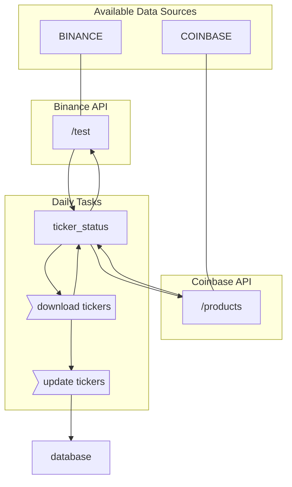

## Setup Raspberry Pi

## Airflow



### Setup

1. From the `airflow` directory, run the following command.
```bash
echo -e "AIRFLOW_UID=$(id -u)" > .env
```

2. In the `docker-compose.yml` file, validate that the `AIRFLOW__CORE__LOAD_EXAMPLES` variable is set to `false`.

### Launching
From the `airflow` directory, run the following command.
```bash
docker-compose up
```

## Database Setup

The database is containerized using *Docker*. The specific service within the `docker-compose` configuration is called `service-db`. This service intitializes and maintains a *Postgres* database with persistant data storage contained in the `database/data` directory.

## Setup MYSQL

### Connect to MYSQL
```sh
sudo mysql -u root -p
```

### Create Databases
```sh
CREATE DATABASE DEV;
CREATE DATABASE UAT;
CREATE DATABASE PROD;
```

### Create Tables
```sql
CREATE TABLE FORECAST (
    SOURCE VARCHAR(50) NOT NULL,
    TICKER VARCHAR(50) NOT NULL,
    TIME_INTERVAL VARCHAR(50) NOT NULL,
    FUTURE_TIME DATETIME NOT NULL,
    PRICE NUMERIC NOT NULL,
    PRICE_L NUMERIC NOT NULL,
    PRICE_U NUMERIC NOT NULL,
    PRICE_C NUMERIC,
    CREATED_DT DATETIME DEFAULT CURRENT_TIMESTAMP,
    LAST_UPDATED_DT DATETIME ON UPDATE CURRENT_TIMESTAMP,
    PRIMARY KEY (SOURCE, TICKER, TIME_INTERVAL, FUTURE_TIME)
);

CREATE TABLE POSITION (
    ID INT NOT NULL AUTO_INCREMENT,
    PAPER BOOLEAN DEFAULT 1,
    SOURCE VARCHAR(50) NOT NULL,
    TICKER VARCHAR(50) NOT NULL,
    DT_O DATETIME NOT NULL,
    DT_C DATETIME,
    QUANTITY NUMERIC NOT NULL,
    PRICE NUMERIC NOT NULL,
    PRICE_C NUMERIC NOT NULL,
    CREATED_DT DATETIME DEFAULT CURRENT_TIMESTAMP,
    LAST_UPDATED_DT DATETIME ON UPDATE CURRENT_TIMESTAMP,
    PRIMARY KEY (ID)
);
```

### Create Users
```sh
CREATE USER 'alec-dev'@'%';
CREATE USER 'alec-uat'@'localhost';
CREATE USER 'alec'@'localhost';

GRANT ALL PRIVILEGES ON DEV.* TO 'alec-dev'@'%';
GRANT ALL PRIVILEGES ON UAT.* TO 'alec-uat'@'localhost';
GRANT ALL PRIVILEGES ON PROD.* TO 'alec'@'localhost';

FLUSH PRIVILEGES;
```

### Open Remote Connections
***Note**: This step is optional. This allows for connections to the `DEV` database remotely.*

Open the config file `/etc/mysql/mariadb.conf.d/50-server.cnf` and comment out the below line. For the change to take effect, restart the MYSQL service with the following command.

`bind-address = 127.0.0.1`
```sh
# Restart MYSQL Service
/etc/init.d/mysql restart
```
